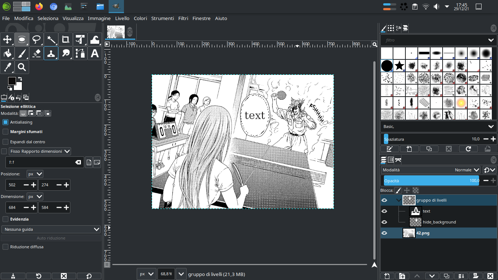

# Add baloon plugin
This is a gimp plugin to create manga balloon easy.

## How to install

### For Gimp 2.99.* and 3.*
1) download the folder add_baloon
2) Inside GIMP program, go to Edit -> Preferences -> Folders -> Plug-Ins and see the folder/path listed.
3) Copy/Move the add_balloon folder from step 1 to one of one of those folders.
4) If you're on Linux, you'll have to browse to the file and right click on it, the Properties, Permissions Tab, Allow Execute as Program (to make it executable). Ex. chmod +x add_balloon/add_balloon.py
5) Restart GIMP.
6) And now plug-in is active for use.

Linux steps example
```
cd ~/.var/app/org.gimp.GIMP/config/GIMP/2.99/plug-ins
mkdir add_balloon
cd add_balloon
wget https://raw.githubusercontent.com/nicolalandro/gimp-baloon-plugin/master/add_balloon/add_balloon.py
chmod +x new_baloon_text.py
# run gimp
```

### For Other Gimp version
1) Download new_baloon_text.py file
2) Inside GIMP program, go to Edit -> Preferences -> Folders -> Plug-Ins and see the folder/path listed.
3) Copy/Move the .py file from step 1 to one of one of those folders.
4) If you're on Linux, you'll have to browse to the file and right click on it, the Properties, Permissions Tab, Allow Execute as Program (to make it executable). Ex. chmod +x new_baloon_text.py
5) Restart GIMP.
6) And now plug-in is active for use.


Linux steps (For GIMP 2.10):
```
cd ~/.config/GIMP/2.10/plug-ins
wget https://raw.githubusercontent.com/nicolalandro/gimp-baloon-plugin/master/new_baloon_text.py 
chmod +x new_baloon_text.py  
# run gimp
```

## How to use

## Python3 version
* select an area


* go to select Add baloon...


* insert text and specify font and font size


* here the results


## Python2 version
* select an area


* go to select Add baloon...


* insert text and specify font and font size


* here the results


